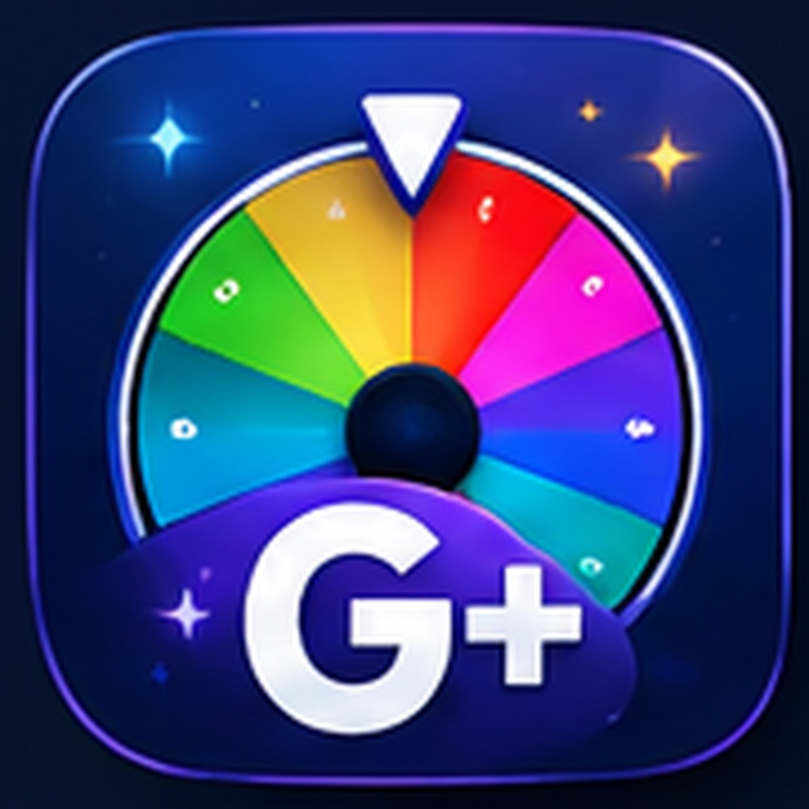
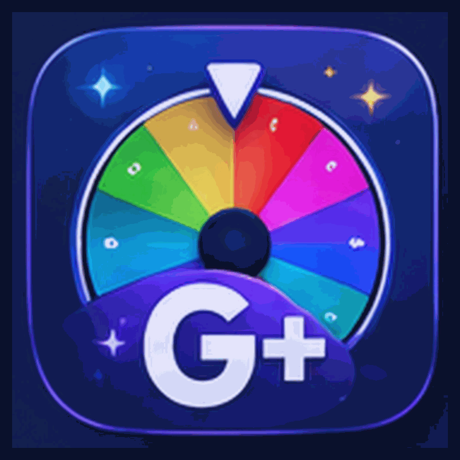
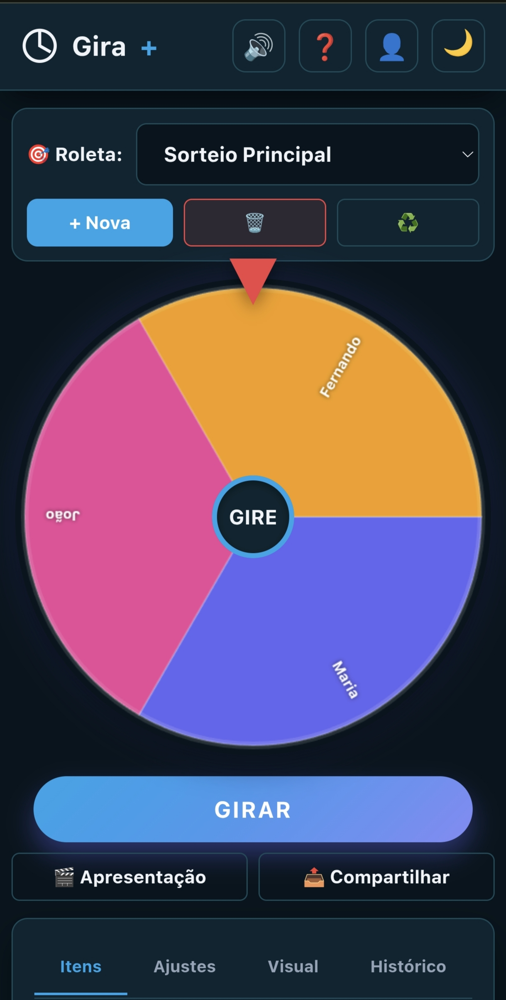
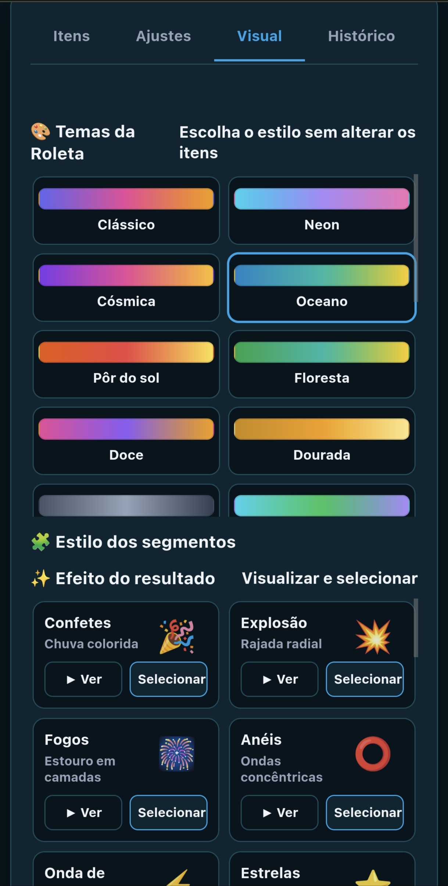
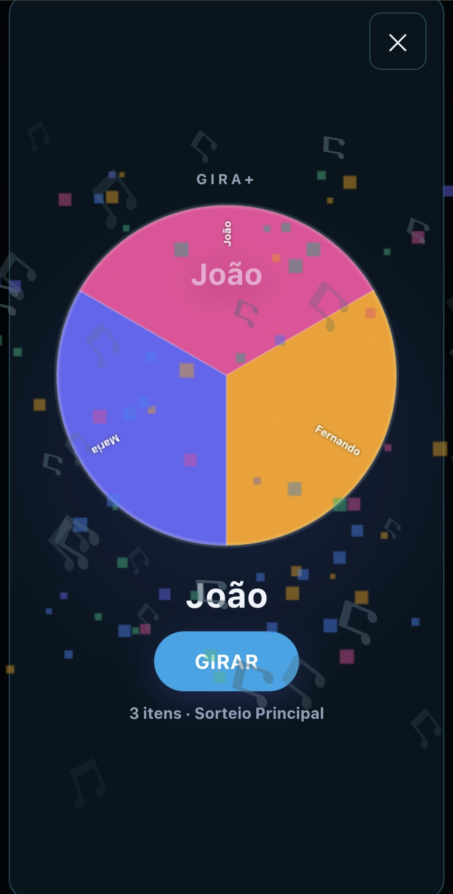
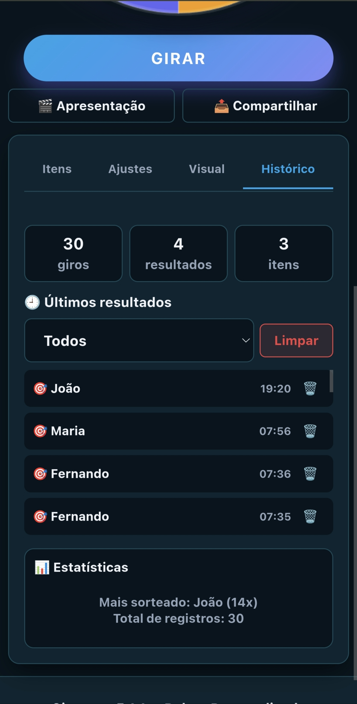
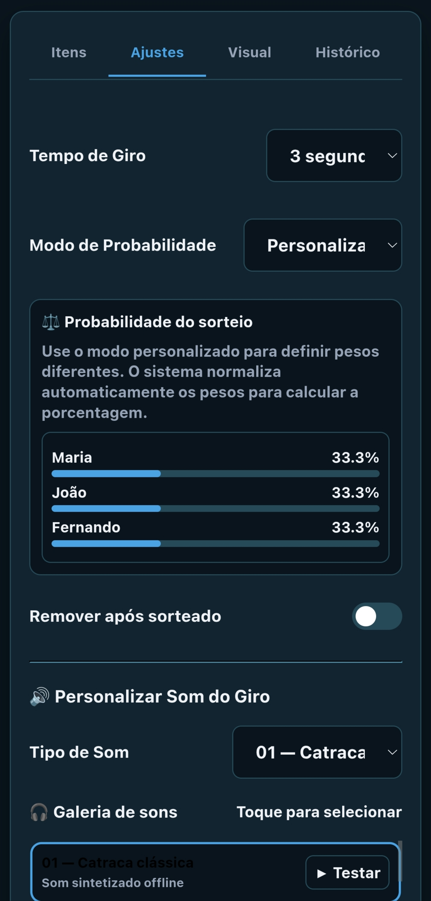

# 🎡 Gira+

<p align="center">
  
</p>

<p align="center"><strong>Uma roleta personalizada para transformar sorteios e dinâmicas em experiências mais visuais, rápidas e interativas.</strong></p>

<p align="center">
  
</p>

<p align="center">
  
  
  
  
</p>

## ✨ Sobre o projeto

O **Gira+**, desenvolvido pela **Koda Sistemas**, é uma aplicação web mobile-first para sorteios, dinâmicas, apresentações, aulas, treinamentos, eventos e atividades em grupo.

O projeto foi pensado para ser simples de usar, visualmente marcante e funcional mesmo em cenários com conectividade limitada. A aplicação trabalha localmente no navegador e foi preparada para instalação como **PWA (Progressive Web App)**.

> **Importante:** o Gira+ é uma ferramenta recreativa e educacional de seleção/sorteio. **Não foi desenvolvido para apostas, jogos de azar ou finalidade financeira.**

---

## 🚀 Principais recursos

- 🎡 Roletas personalizadas com múltiplos itens.
- ⚖️ Modo de probabilidade/peso para sorteios ponderados.
- 🎨 Temas e estilos visuais para os segmentos.
- ✨ Galeria de efeitos para o resultado.
- 🎬 Modo Apresentação para uso em aulas, eventos e dinâmicas.
- 🔊 Sistema de som para o giro e efeitos.
- 📜 Histórico dos resultados e estatísticas.
- 👤 Perfil local e informações da instalação.
- 💾 Armazenamento local para continuar utilizando os dados sem depender de servidor.
- 📱 Interface responsiva para celular, tablet e desktop.
- 📦 PWA com instalação na tela inicial e cache local do aplicativo.

## 🎛️ Botões do topo

O cabeçalho concentra os controles rápidos mais importantes do Gira+:

| Botão | Função |
|---|---|
| 🔊 **Som** | Liga/desliga os sons da experiência e controla o áudio sem interromper o funcionamento da roleta. |
| ❓ **Tutorial** | Abre o guia interno com explicações sobre criação de roletas, participantes, pesos, modos, efeitos, áudio, apresentação, histórico e backup. |
| 👤 **Perfil** | Acessa as informações da conta/perfil e as opções disponíveis para o ambiente local. |
| 🌙 / ☀️ **Tema** | Alterna entre os modos escuro e claro, preservando a preferência do usuário. |

Esses controles foram pensados para ficarem sempre acessíveis, especialmente no uso pelo celular.

## 🎬 Modo Apresentação

O modo de apresentação amplia a roleta para uma experiência mais adequada a uma tela compartilhada. O fluxo é simples:

**Abrir Apresentação → Girar → acompanhar a roleta → visualizar o vencedor e o efeito → Girar novamente ou fechar.**

Isso é útil para salas de aula, treinamentos, reuniões, eventos e dinâmicas em grupo.

## 🎨 Experiência visual

O Gira+ possui uma área dedicada à personalização da roleta e dos resultados. O usuário pode escolher estilos, temas e efeitos antes de executar o sorteio.

A seleção de efeitos é intencional: o usuário escolhe o comportamento visual que deseja utilizar, em vez de receber um efeito aleatório.

## 📱 PWA

O projeto inclui:

- `manifest.json` para instalação como aplicativo.
- `sw.js` para cache do App Shell e funcionamento offline do núcleo.
- Ícones `180`, `192` e `512` pixels.
- Registro automático do Service Worker quando executado em contexto compatível.

### Instalação

1. Publique o projeto em um servidor HTTPS, como GitHub Pages ou Vercel.
2. Abra o endereço pelo navegador.
3. Utilize **Adicionar à tela inicial / Instalar aplicativo**, conforme o navegador e o dispositivo.

> Service Workers não funcionam em `file://`; para testar o PWA, use um servidor local ou uma hospedagem HTTPS.

## 🖼️ Telas do sistema

### Tela principal



### Personalização visual e efeitos



### Modo Apresentação



### Histórico



### Ajustes e áudio



## 🧩 Estrutura

```text
Gira+
├── index.html
├── manifest.json
├── sw.js
├── LICENSE
├── README.md
└── assets/
    ├── icon-180.png
    ├── icon-192.png
    ├── icon-512.png
    └── gira-plus-demo.gif
```

A aplicação principal permanece concentrada no `index.html`, mantendo a proposta de distribuição simples e fácil de executar.

## 🔐 Privacidade e armazenamento

O núcleo atual não depende de um backend para funcionar. Os dados da aplicação são mantidos localmente no navegador conforme as funcionalidades do sistema.

O projeto não deve ser interpretado como um serviço de armazenamento em nuvem ou autenticação remota.

## 🛠️ Tecnologias

- HTML5
- CSS3
- JavaScript
- Canvas API
- LocalStorage / IndexedDB
- Web Audio API
- Service Worker
- Web App Manifest

## 🧭 Filosofia do projeto

**Evoluir > Reconstruir**

O desenvolvimento do Gira+ prioriza evolução incremental, preservação de funcionalidades existentes, reutilização de código, experiência mobile-first e correção de regressões antes de adicionar complexidade.

## 📌 Status

**Versão atual: 5.2.0**

Projeto em evolução contínua pela **Koda Sistemas**.

## 📄 Licença

Distribuído sob a **Apache License 2.0**. Consulte o arquivo [`LICENSE`](LICENSE) para os termos completos.

---

<p align="center"><strong>Gira+ • Koda Sistemas</strong></p>
